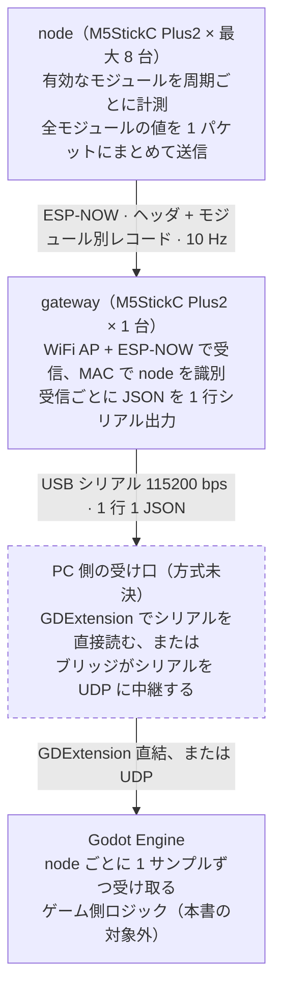
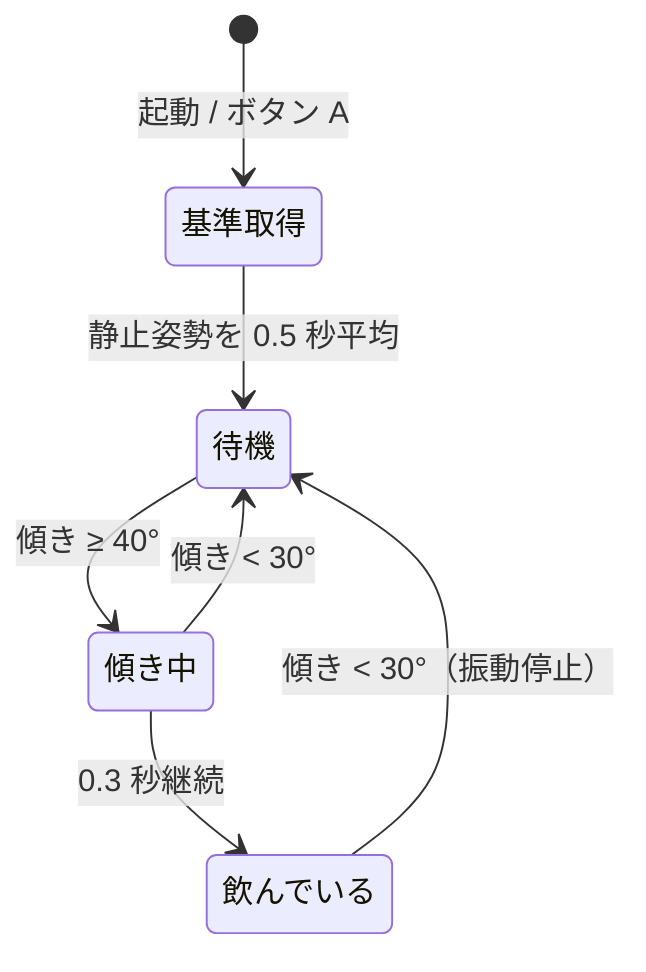

# Beer-fw システム構成設計書

最終更新: 2026-10-04

## 概要

複数台の M5StickC Plus2（node）で計測したセンサー値を ESP-NOW で 1 台の gateway に集約し、PC 上の Godot Engine から入力として使えるようにする。

- **現状**: node（最大 8 台）→ gateway → USB シリアルの JSON 出力までを実装済み。搭載モジュールは加速度、振動（Vibration Hat）、飲酒検出。ジョッキを傾けている間、node 単体でゴクゴクと振動する。
- **本書のスコープ**: FW の構成、通信プロトコル、Godot 接続に向けた方針。
- **対象外**: Godot 側ゲームロジックの設計。
- ファイル構成の設計意図は [fw-structure-proposal.md](fw-structure-proposal.md) を参照。

## 全体構成

データは node → gateway → PC → Godot の一方向に流れる。



PC 側の受け口は方式が未決（「Godot 連携方式」を参照）。Godot からデバイスへの逆方向の通信は現状ない。

## ハードウェア・開発環境

node と gateway は同じデバイス・同じソースツリーを使い、PlatformIO の環境で役割を切り替える。

| 項目 | 内容 |
| --- | --- |
| デバイス | M5StickC Plus2（ESP32、内蔵 IMU、LCD、ボタン A） |
| platform | espressif32@6.5.0 |
| board | m5stick-c |
| framework | arduino |
| ライブラリ | m5stack/M5StickCPlus2@^1.0.2、m5stack/M5Unified@0.1.12 |
| ビルド前処理 | scripts/fix_dfrobot.py（依存で入る DFRobot_GP8XXX の `analogWriteResolution` 呼び出しをパッチ） |
| ビルド環境 | `node`（`-DROLE_NODE`）、`mug`（node の省電力版。送信時だけ無線を起動）、`gateway`（`-DROLE_GATEWAY`） |
| シリアル | USB、115200 bps |

### ビルド・書き込み

```sh
pio run                                   # node と gateway を両方ビルド
pio run -e gateway -t upload              # gateway を書き込み
PLATFORMIO_BUILD_FLAGS="-DNODE_ID=2" pio run -e node -t upload   # node を ID 2 で書き込み
```

### ディレクトリ構成

```text
/
├── platformio.ini        # ビルド環境（node / gateway）
├── doc/                  # 設計資料
├── scripts/              # ビルド補助スクリプト
└── src/
    ├── main.cpp          # setup() / loop()。起動順と呼び出しだけ
    ├── config.h          # コンパイル時設定・モジュール有効/無効
    ├── core/             # センサーに依存しない共通処理
    │   ├── system        # M5・シリアル初期化、毎ループの共通処理
    │   ├── scheduler     # モジュールの init / update を周期で呼ぶ
    │   ├── comm          # ESP-NOW 送受信、gateway の受信リングバッファ
    │   ├── protocol.h    # パケット形式・モジュール ID
    │   ├── power         # 電池残量
    │   ├── display       # LCD の共通レイアウト
    │   └── log.h         # "# " 始まりのログマクロ
    ├── modules/          # センサー・機能モジュール
    │   ├── module.h      # 共通インターフェース
    │   ├── registry.cpp  # 有効なモジュールの一覧
    │   ├── _template.cpp # 新規モジュールのひな形
    │   ├── accel.cpp     # 加速度
    │   ├── vibration.cpp/.h  # 振動（Vibration Hat U159）。操作 API をヘッダで公開
    │   └── drink.cpp     # 飲酒検出。accel と vibration を使う
    └── app/
        ├── node.cpp      # 計測して送る
        └── gateway.cpp   # 受けて PC へ出す
```

## node 設計

node は有効なモジュールを各自の周期で計測し、`COMM_TX_PERIOD_MS`（既定 100 ms）ごとに全モジュールの最新値を 1 パケットにまとめて送る。

**初期化**

1. `system_init()`: M5、シリアル、LCD、電池残量を初期化する。
2. `comm_init()`: WiFi を STA モード・切断状態にし、ESP-NOW を初期化して `COMM_GATEWAY_MAC` をピア登録する。失敗したら赤画面で停止する。
3. 自機 MAC を 2 秒表示する。
4. `scheduler_init()`: 登録された全モジュールの `init()` を呼ぶ。失敗したモジュールだけ無効にして続行する。

**メインループ**

1. `system_update()`: ボタン状態と電池残量（5 秒ごと）を更新する。
2. `scheduler_run()`: 周期が来たモジュールの `update()` を呼ぶ。
3. 送信周期が来たら、各モジュールの `encode()` でパケットを組み立てて送る。
4. LCD は `DISPLAY_PERIOD_MS`（100 ms）ごとに更新する。各モジュールの `to_text()`、送信結果、電池残量を表示する。

## gateway 設計

gateway は最大 8 台の node を MAC で識別し、受信パケットごとに 1 行の JSON をシリアルへ出す。

**初期化**

1. WiFi を AP モードで起動する（SSID `ESPNOW-RX`、チャンネル `COMM_ESPNOW_CHANNEL` = 1、非公開）。目的は ESP-NOW の安定動作。
2. ESP-NOW を初期化し、受信コールバックを登録する。
3. AP MAC を 3 秒表示する。node の `COMM_GATEWAY_MAC` にはこの AP MAC を設定する。

**受信処理**

- 受信コールバックは `COMM_RX_QUEUE_LEN`（16）段のリングバッファにパケットを積むだけ。コールバックと loop の間は `portMUX` で排他する。満杯時は破棄して数え、loop 側で警告を出す。
- loop はバッファが空になるまで取り出し、ヘッダを検証して node 表に記録し、JSON を出力する。
- `seq` の飛びから欠落数（`lost`）を数える。1000 以上の飛びは node の再起動とみなして数えない。
- ボタン A で表示する node を切り替える。LCD は表示中の node が更新されたときだけ、最短 100 ms 間隔で描き直す。

## 振動モジュール（Vibration Hat）

M5StickC Vibration Hat（M5Stack U159、[製品ページ](https://www.switch-science.com/products/8867)）を node に取り付けて使う。

| 項目 | 内容 |
| --- | --- |
| 制御ピン | G26（Hat ヘッダ） |
| 駆動方式 | LEDC PWM、チャンネル 1、10 kHz、8 bit（チャンネル 7 は LCD バックライトが使用） |
| モーター | 定格 3.0 V、85 mA、12,000 rpm |
| 操作 API | `vibration_start(強さ 0〜100 %, 時間 ms)`（時間 0 は停止まで継続）、`vibration_stop()`、`vibration_is_active()` |
| 動作確認 | `PLATFORMIO_BUILD_FLAGS="-DVIBRATION_BOOT_TEST_MS=500" pio run -e node -t upload` で起動時に 0.5 秒振動 |

`MODULE_VIBRATION_ENABLE` が 0 のとき、API は何もしない関数になる。呼び出し側に `#if` は不要。

## 省電力

ジョッキ用（環境 `mug`）は電池で動かすため、次の対策を入れている。

| 対策 | 内容 | 設定 |
| --- | --- | --- |
| 送信時だけ無線を起動 | `mug` 環境では送信のたびに WiFi / ESP-NOW を起動し、送信完了（最大 30 ms 待ち）で止める。送るのは 1 秒ごとと、モジュールの状態変化時（`Module.take_event()`）。node 側は受信できない | `COMM_LOW_POWER=1`、`COMM_TX_PERIOD_MS=1000`（platformio.ini の `mug`）。通信自体を止めるなら `COMM_ENABLE=0` |
| 画面の自動消灯 | 操作がなければ 10 秒でパネルをスリープし、バックライトを消す。ボタン A / B で点灯 | `DISPLAY_AUTO_OFF_MS`、`DISPLAY_BRIGHTNESS`（64） |
| CPU クロック | 240 MHz → 80 MHz | `POWER_CPU_FREQ_MHZ` |
| 待ち時間の light sleep | 次のモジュール処理（最短 20 ms 後）まで light sleep。無線停止中・画面オフ・振動なしのときだけ | `POWER_LIGHT_SLEEP_ENABLE` |
| 未使用デバイス | 内蔵ブザーとマイクを初期化しない | `system_init()` |

振動中は light sleep しない（PWM が止まるため）。モジュールは `Module.busy()` で light sleep を止められる。

無線を起動したままの `node` 環境（100 ms ごと送信）では light sleep しない（`delay()` で CPU はアイドル）。この SDK では接続なし時の WiFi 省電力（`CONFIG_ESP_WIFI_STA_DISCONNECTED_PM_ENABLE`）が無効のため、待受中の省電力は使えない。

## 電池残量の監視

| 残量 | 動作 | 解除 |
| --- | --- | --- |
| 20 % 以下 | 「残量低下」フラグ（`"low":1`）を立て、すぐ gateway へ送る。node の画面に `LOW BAT` | 25 % 以上に戻ったとき |
| 5 % 以下 | 電源が落ちるまで 100 % で振動し続ける（飲酒の振動より優先）。`"alarm":1` もすぐ送る | 10 % 以上に戻ったとき |

設定は `config.h` の `LOWBAT_LOW_PERCENT`、`LOWBAT_ALARM_PERCENT`、`LOWBAT_HYSTERESIS`。gateway 側（PC・Godot）は `battery.low` を見れば交換・充電の合図にできる。

## 飲酒検出（ビールジョッキ）

M5Stick をジョッキに入れ、飲む動作（持ち上げて手前に傾ける）の間、ゴクゴクと飲んでいるように振動させる。node 単体で完結し、gateway や PC は不要。



| 項目 | 内容 |
| --- | --- |
| 直立の基準 | 起動直後、またはボタン A を押した直後の重力方向。ジョッキを机に置いた状態で行う |
| 傾き | 基準とのなす角（方向は問わない）。M5Stick の入れ向きに依存しない |
| 「持ち上げ」の扱い | 加速度だけでは高さを測れないため判定しない。満たしたジョッキを机に置いたまま 40° 傾けることはないので、傾きで代用する |
| ゴクッ 1 回 | 100 % 160 ms → 休 40 ms → 100 % 120 ms |
| ゴクッの間隔 | 40° で 650 ms、90° で 350 ms。深く傾けるほど速くなる |
| 設定 | `config.h` の `DRINK_*`。`MODULE_DRINK_ENABLE` には accel と vibration が必要（不足はビルドエラー） |

## 通信プロトコル

無線区間は「ヘッダ + モジュール別レコード」のバイナリ、PC 区間は 1 行 1 JSON のテキストである。定義は `src/core/protocol.h`。

**ESP-NOW パケット（node → gateway、最大 250 バイト）**

| 部分 | フィールド | 型 | 意味 |
| --- | --- | --- | --- |
| ヘッダ（9 バイト） | `version` | uint8 | プロトコル版数（現在 1）。不一致のパケットは gateway が破棄 |
| | `node_id` | uint8 | `NODE_ID`（1〜255） |
| | `seq` | uint16 | 送信ごとに +1 |
| | `time_ms` | uint32 | node の `millis()` |
| | `record_count` | uint8 | 後続レコード数 |
| レコード（繰り返し） | `module_id` | uint8 | `MODULE_ID_*` |
| | `length` | uint8 | 直後のデータ長 |
| | データ | — | 形式は各モジュールが決める |

gateway は知らない `module_id` のレコードを `length` で読み飛ばす。

**モジュール ID**

| ID | モジュール | データ |
| --- | --- | --- |
| 0x01 | accel | float x, y, z（12 バイト） |
| 0x02 | vibration | uint8 現在の振動の強さ 0〜100 %（1 バイト） |
| 0x03 | drink | uint8 フラグ（bit0 飲んでいる、bit1 検出中）、uint8 傾き [deg]、uint16 累計ゴクッ回数（4 バイト） |
| 0x04 | lowbat | int8 電池残量 [%]、uint8 フラグ（bit0 残量低下 ≤20 %、bit1 電池切れ警報 ≤5 %）（2 バイト） |

**シリアル出力（gateway → PC、115200 bps）**

```json
{"node":1,"mac":"AA:BB:CC:DD:EE:FF","seq":42,"t":12345,"rx":43,"lost":0,"accel":{"x":0.1234,"y":-0.4567,"z":0.9789},"vibration":0,"drink":{"armed":1,"active":0,"tilt":3,"gulps":0},"battery":{"level":80,"low":0,"alarm":0}}
```

| フィールド | 意味 |
| --- | --- |
| `node` | node の `NODE_ID`。書き込み時に決まる固定値なので、Godot 側のプレイヤー識別に使える |
| `mac` | node の MAC |
| `seq` / `t` | パケットのシーケンス番号と node 側の時刻 [ms] |
| `rx` / `lost` | その node からの累計受信数と推定欠落数 |
| モジュールのキー | 各モジュールの `to_json()` が出す要素（`accel` など） |

ログ行はすべて `# ` で始まる。PC 側は `{` で始まる行だけを JSON として読めばよい。

## Godot 連携方式

推奨は「USB シリアルを維持し、PC 側で受ける」方式。無線構成を変えずに済む。ただし Godot 4 には標準のシリアル API がないため、受け口を別に用意する必要がある。

| 方式 | Godot 側の受け口 | gateway FW の変更 | 主な制約 |
| --- | --- | --- | --- |
| USB シリアル + GDExtension | シリアル用 GDExtension を導入 | 不要 | 拡張の導入と OS ごとのビルドが必要 |
| USB シリアル + PC ブリッジ | `PacketPeerUDP`（ブリッジがシリアルを UDP に中継） | 不要 | ブリッジ（Python 等）を別プロセスで動かす |
| WiFi UDP | `PacketPeerUDP` で直接受信 | WiFi 接続と UDP 送信を追加 | ESP-NOW と WiFi を同一チャンネルに揃える必要があり、node 側も影響を受ける |
| WiFi WebSocket | `WebSocketPeer` | WebSocket サーバーを追加 | UDP と同じチャンネル制約に加え、通信のオーバーヘッドが大きい |

どの方式でも、Godot 側は「1 メッセージ = 1 パケット分の JSON」を `node` ごとに受け取る形に揃える。

## 現状の課題

| 課題 | 場所 | 影響 | 方針 |
| --- | --- | --- | --- |
| 送信周期 100 ms（10 Hz） | `config.h` `COMM_TX_PERIOD_MS`、`ACCEL_PERIOD_MS` | ゲーム入力としては遅延が大きい | 必要なレートが決まったら設定値を下げる |
| gateway MAC がハードコード | `config.h` `COMM_GATEWAY_MAC` | gateway を交換すると全 node の再ビルドが必要 | ブロードキャスト送信、またはペアリング手順を検討する |
| 115200 bps の帯域 | gateway シリアル | node の台数とレートを上げると詰まる（JSON 1 行 約 130 バイト） | ボーレートを上げる。または JSON を短くする |
| LCD を毎回全面再描画 | `core/display` | ちらつき | 必要なら差分描画にする |
| 実機での動作確認が未実施 | — | 新構成は 2026-10-04 時点でビルド確認のみ | node・gateway を書き込んで確認する |

解決済み（2026-10-04 の構成変更で対応）: 受信キュー 1 件による欠落、ログと JSON の混在、ペイロードに版数・シーケンス番号がない、Sender / Receiver で構造体を二重管理。

## 未決事項

- [ ] Godot 連携方式をどれにするか（推奨: USB シリアル + PC ブリッジか GDExtension）
- [ ] 使用する Godot のバージョンと対象 OS
- [ ] ゲームで必要な送信レートと許容できる遅延
- [ ] 同時に使う node の台数（現状の上限は 8 台）
- [ ] 加速度以外に送るデータはあるか（ジャイロ、ボタン、電池残量など）
- [ ] 飲酒検出のしきい値・振動パターンの実機調整（ジョッキの重さ、M5Stick の固定方法で変わる）
- [ ] Godot からデバイスへの逆方向通信（振動以外に LCD 表示など）は必要か
